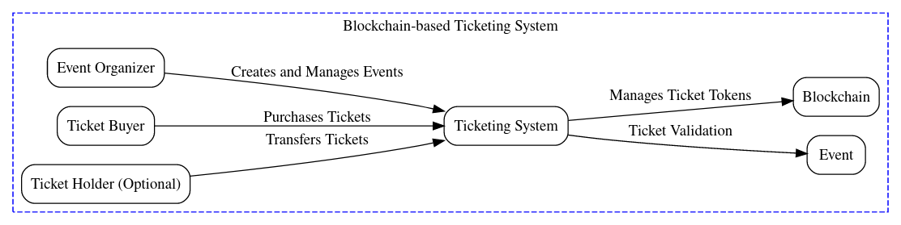
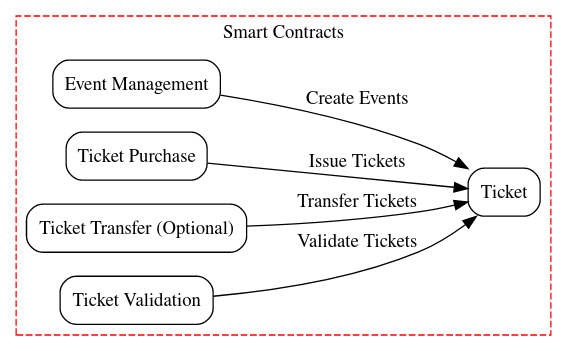
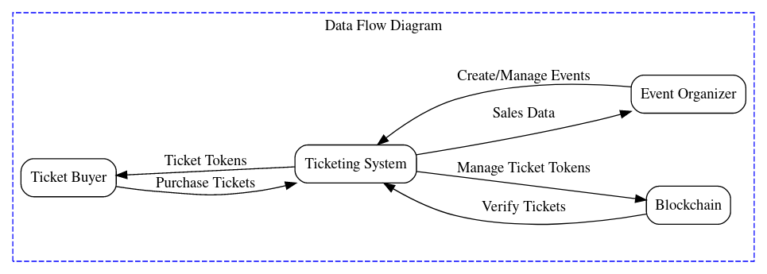

# Blockchain-based Ticketing System: Requirements Document

This document outlines the requirements for a blockchain-based ticketing system designed to improve transparency, security, and efficiency in event ticketing.

## 2. System Overview

The system will leverage blockchain technology to create a secure and transparent platform for event organizers and ticket holders. It will enable:

- **Event creation and management:** Organizers can create events, specify details (date, time, price, total tickets), and manage ticket sales.
- **Secure ticket issuance:** Purchased tickets will be represented as tokens on the blockchain, ensuring authenticity and preventing duplication.
- **Ticket transfer (optional):** Users can securely transfer tickets to other users with ownership verification.
- **Ticket validation:** Organizers can validate ticket ownership at event entry using the blockchain ledger.

## 3. User Roles

- **Event Organizer:** Creates and manages events, sets ticket prices, and withdraws funds from ticket sales.
- **Ticket Buyer:** Purchases event tickets using cryptocurrency.
- **Ticket Holder (Optional):** Receives transferred tickets and attends events with valid tickets.

## 4. Functional Requirements

- **Event Management:**
    - Organizers can create events with details (name, date, time, price, total tickets).
    - The system tracks the number of tickets available for each event.
- **Ticket Purchase:**
    - Users can browse available events.
    - Users can purchase tickets for events using a supported cryptocurrency wallet.
    - The system verifies sufficient funds before completing the purchase.
    - Upon successful purchase, a ticket token is issued to the buyer's wallet address.
- **Ticket Transfer (Optional):**
    - Ticket holders can transfer tickets to other users' wallet addresses.
    - The system verifies ownership before allowing transfer.
- **Ticket Validation:**
    - Organizers can scan ticket tokens at the event entry to verify authenticity and prevent double entry.

## 5. Non-Functional Requirements

- **Security:**
    - All communication should be encrypted using secure protocols.
    - Smart contracts should be thoroughly audited for vulnerabilities.
    - The system should be resistant to unauthorized access and manipulation.
- **Scalability:**
    - The system should handle a high volume of transactions during peak periods.
    - The chosen blockchain platform should be scalable to accommodate future growth.
- **Performance:**
    - Transaction processing should be efficient with minimal latency.
    - The user interface should be responsive and provide a smooth user experience.

## 6. Additional Considerations

- Support for different ticket types (e.g., general admission, VIP) can be explored.
- Integration with event management platforms for seamless event data management might be beneficial.
- A dispute resolution mechanism can be implemented to address potential ticket transfer conflicts.

## 7. Future Enhancements

- Integration with secondary market functionalities for ticket resale.
- Implementation of a decentralized event discovery platform.
- Exploration of integrating with ticketing peripherals (e.g., scanners).

 
  

___

# System Diagram

 
 

# Smart Contract

 
 

# Dataflow

## Smart Contracts

The system uses two main smart contracts: `EventManagement` and `Ticket`.

### EventManagement Contract

The `EventManagement` contract is responsible for managing events and tickets. It provides the following functionalities:

- `createEvent`: Allows the contract owner to create a new event with a name, date, time, ticket price, and total number of tickets.
- `buyTicket`: Allows users to buy tickets for a specific event. It checks if the user has sent enough Ether and if there are enough tickets available.
- `checkTickets`: Allows users to check how many tickets they have bought for a specific event.
- `getTotalEvents`: Returns the total number of events.
- `getTotalTickets`: Returns the total number of tickets for a specific event.
- `updateEvent`: Allows the event organizer to update the details of an event.
- `deleteEvent`: Allows the event organizer to delete an event.
- `getEventDetails`: Returns the details of a specific event.
- `incrementTicketsSold`: Increments the number of tickets sold for a specific event to a specific address.

### Ticket Contract

The `Ticket` contract is responsible for managing ticket ownership. It provides the following functionalities:

- `issueTicket`: Allows the contract owner to issue a ticket to a specific address for a specific event. It checks if the address already has a ticket for the event and if there are enough tickets available.
- `transferTicket`: Allows a ticket owner to transfer their ticket to another address.
- `getTicketDetails`: Returns whether a specific address has a ticket for a specific event.

The `Ticket` contract uses the `EventManagement` contract to check the details of events and tickets.